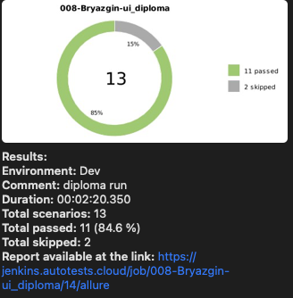

# Проект автоматизации тестирования сайта Lime.

## Краткое описание.
Проект содержит UI автотесты на функционал интернет магазина [Lime](https://lime-shop.com/ru_ru/). 

UI тесты реализованы в связке `Python`+`Selene`.  
Запуск тестов осуществляется в `Jenkins`.  
Для отчетов по результатам прогона используется `Allure` + отправляется уведомление в телеграм с краткими результатами.

## Что покрыто тестами
- успешная авторизация
- авторизация с неверным паролем
- авторизация с неверным логинов
- закрытие модального окна авторизации
- открытие окна чата
- закрытие окна чата
- удаление введенного имени при закрытии окна чата
- удаление введенного email'а при закрытии окна чата
- изменение языка сайта
- открытие модального окна, при нажатии кнопки "Подписаться"
- проверка обязательности введения email при подписке на рассылку


## Технологии.
 
 
 
 

## Локальный запуск тестов

### Выполнить в cmd:

```bash
python -m venv .venv
source .venv/bin/activate
pip install -r requirements.txt
pytest tests
```

### Получение отчёта:
```bash
allure serve build/allure-results
```

## Запуск на сервере.

Запуск тестов выполняется в проекте [Jenkins](https://jenkins.autotests.cloud/job/008-Bryazgin-ui_diploma/).

### 1. Перейти в [проект](https://jenkins.autotests.cloud/job/008-Bryazgin-ui_diploma/) и нажать кнопку `Build with Parameters`.


### 2. Указать параметры сборки и нажать кнопку `Build`
`COMMENT` - комментарий, указывающий особенности сборки  
`ENVIRONMENT` - выбор среды запуска тестов  


### 3. Дождаться окончания прогона
 

### 4. Для просмотра отчета нажать одну из иконок 
 

### Пример отчета в Allure


### Пример дэшборда в Allure testops


### Пример запуска теста в Selenoid


### По результатам прогона получаем уведомление с краткой информацией в телеграм
<p align="center"> 
    
</p>
